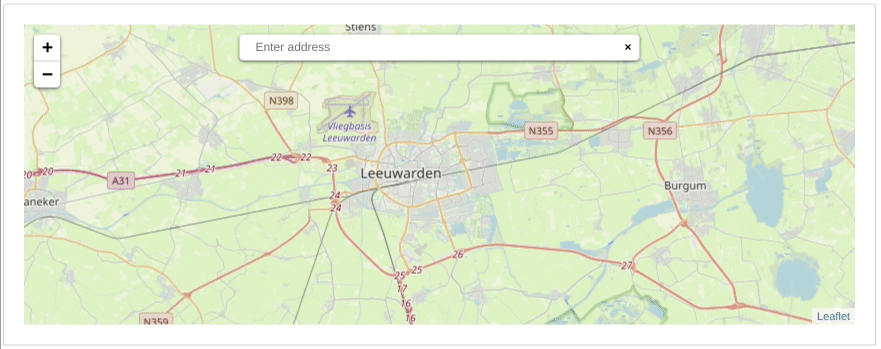

# Leaflet.GeoSearch

<!-- ALL-CONTRIBUTORS-BADGE:START - Do not remove or modify this section -->
[](#contributors-)
<!-- ALL-CONTRIBUTORS-BADGE:END -->

**Demo and Docs: [smeijer.github.io/leaflet-geosearch](https://smeijer.github.io/leaflet-geosearch)**



## Installation

**more docs @** https://smeijer.github.io/leaflet-geosearch/#installation

with npm:

```bash
npm install --save leaflet-geosearch
```

or yarn:

```bash
yarn add leaflet-geosearch
```

## Browser support / Polyfills

**more docs @** https://smeijer.github.io/leaflet-geosearch/#browser-support--polyfills

This library is written with the latest technologies in mind. Thereby it is required to include some polyfills when you wish to support older browsers. These polyfills are recommended for IE and Safari support:

- [babel-polyfill], for `array.includes` support.
- [unfetch], for `fetch` requests.

# About

This library adds support for geocoding _(address lookup, a.k.a. geoseaching)_
to your (web) application. It comes with controls to be embedded in your [Leaflet] map.

Check out the [docs] for various possibilities.

The library uses so-called "providers" to take care of building the correct
service URL and parsing the retrieved data into a uniform format. Thanks to this
architecture, it is pretty easy to add your own providers, so you can use
your own geocoding service(s).

The control comes with a number of default providers:

- [Algolia]
- [Bing]
- [Esri]
- [Geocode Earth]
- [Google]
- [LocationIQ]
- [OpenCage]
- [OpenStreetMap]
- [Pelias]
- [Mapbox](https://docs.mapbox.com/help/tutorials/local-search-geocoding-api/)
- [GeoApiFR](https://geo.api.gouv.fr/adresse)
- [Geoapify](https://apidocs.geoapify.com/docs/geocoding/forward-geocoding/#about)

Although this project is still named `leaflet-geosearch`, this library is also
usable without LeafletJS, and does not have any dependencies whatsoever.

# Usage

**more docs @** https://smeijer.github.io/leaflet-geosearch/usage

Let's first start with an little example on how to use this control without
leaflet. For example as an address lookup on a webshop order form. Perhaps to
search for the closest alternative package delivery point? Or to link it to your
own custom map component.

```js
// import
import { OpenStreetMapProvider } from 'leaflet-geosearch';

// setup
const provider = new OpenStreetMapProvider();

// search
const results = await provider.search({ query: input.value });
```

Of course, something like this should be bound to something like a form or
input:

```js
import { OpenStreetMapProvider } from 'leaflet-geosearch';

const form = document.querySelector('form');
const input = form.querySelector('input[type="text"]');

form.addEventListener('submit', async (event) => {
  event.preventDefault();

  const results = await provider.search({ query: input.value });
  console.log(results); // » [{}, {}, {}, ...]
});
```

Instead of es6 `async` / `await` you can also use promises like:

```js
provider.search({ query: '...' }).then(function (result) {
  // do something with result;
});
```

## Results

The `search` event of all providers return an array of `result objects`. The
base structure is uniform between the providers. It provides a object like:

```js
const result = {
  x: Number, // lon,
  y: Number, // lat,
  label: String, // formatted address
  bounds: [
    [Number, Number], // s, w - lat, lon
    [Number, Number], // n, e - lat, lon
  ],
  raw: {}, // raw provider result
};
```

The contents of the `raw` property differ per provider. This is the unprocessed
result from the 3th party service. This property is included for developer
convenience. `leaflet-geosearch` does not use it. If you need to know the
contents of this property, you should check the 3th party developer docs. (or
use your debugger)

# Providers

When `OpenStreetMap` does not match your needs; you can also choose to use the
`Algolia`, `Bing`, `Esri`, `Geocode Earth`, `Google`, `LocationIQ`, `OpenCage`, or `Pelias` providers. Most of those providers do however require API
keys. See the documentation pages on the relevant organisations on how to obtain
these keys.

In case you decide to write your own provider, please consider submitting a PR
to share your work with us.

Providers are unaware of any options you can give them. They are simple proxies
to their endpoints. There is only one `special property`, and that is the `params`
option. The difference being; that `params` will be included in the endpoint url.
Often being used for `API KEYS`, where as the other attributes can be used for
provider configuration.

# Using with LeafletJS

This project comes with a leaflet control to hook the search providers into
leaflet. The example below uses the `OpenStreetMap Provider`, but you can exchange
this with on of the other included providers as well as your own custom made
providers. Remember to setup the provider with a `key` when required (Google and
Bing for example).


```js
import L from 'leaflet';
import { GeoSearchControl, OpenStreetMapProvider } from 'leaflet-geosearch';

const provider = new OpenStreetMapProvider();

const searchControl = new GeoSearchControl({
  provider: provider,
});

const map = new L.Map('map');
map.addControl(searchControl);
```

# Using with react-leaflet

Usage with `react-leaflet` is similar to the usage with plain Leaflet. This example
uses the new MapBoxProvider and adds an api key to the `params` list when accessing
the remote API. Note the `useMap` hook which is the only notable diffrence to the
leaflet example.

```jsx
import { GeoSearchControl, MapBoxProvider } from 'leaflet-geosearch';
import { useMap } from 'react-leaflet';
const SearchField = ({ apiKey }) => {
  const provider = new MapBoxProvider({
    params: {
      access_token: apiKey,
    },
  });

  // @ts-ignore
  const searchControl = new GeoSearchControl({
    provider: provider,
  });

  const map = useMap();
  useEffect(() => {
    map.addControl(searchControl);
    return () => map.removeControl(searchControl);
  }, []);

  return null;
};
```

The `useEffect` hook used in `SearchField` even allows for conditional rendering of the
search field.

```jsx
import { MapContainer } from 'react-leaflet';
const MyMap = () => {
  // ...
  return (
    <MapContainer>
      {showSearch && <SearchField apiKey={apiKey} />}

      {/* ... */}
    </MapContainer>
  );
};
```

## GeoSearchControl

There are some configurable options like setting the position of the search input
and whether or not a marker should be displayed at the position of the search result.


There are two visual styles of this control. One is the more 'leaflet-way' by
putting the search control under a button (see image above). And one where the
search control is permanently shown as a search bar (see image under
[using with LeafletJS](#using-with-leafletjs)).

**Render style**

This render style can be set by the optional `style` option.

```js
new GeoSearchControl({
  provider: myProvider, // required
  style: 'bar', // optional: bar|button  - default button
}).addTo(map);
```

**AutoComplete**

Auto complete can be configured by the parameters `autoComplete` and
`autoCompleteDelay`. A little delay is required to not DDOS the server on every
keystroke.

```js
new GeoSearchControl({
  provider: myProvider, // required
  autoComplete: true, // optional: true|false  - default true
  autoCompleteDelay: 250, // optional: number      - default 250
}).addTo(map);
```

**Show result**

There are a number of options to adjust the way results are visualized.

```js
new GeoSearchControl({
  provider: myProvider, // required
  showMarker: true, // optional: true|false  - default true
  showPopup: false, // optional: true|false  - default false
  marker: {
    // optional: L.Marker    - default L.Icon.Default
    icon: new L.Icon.Default(),
    draggable: false,
  },
  popupFormat: ({ query, result }) => result.label, // optional: function    - default returns result label,
  resultFormat: ({ result }) => result.label, // optional: function    - default returns result label
  maxMarkers: 1, // optional: number      - default 1
  retainZoomLevel: false, // optional: true|false  - default false
  animateZoom: true, // optional: true|false  - default true
  autoClose: false, // optional: true|false  - default false
  searchLabel: 'Enter address', // optional: string      - default 'Enter address'
  keepResult: false, // optional: true|false  - default false
  updateMap: true, // optional: true|false  - default true
});
```

`showMarker` and `showPopup` determine whether or not to show a marker and/or
open a popup with the location text.

`marker` can be set to any instance of a (custom) `L.Icon`.

`popupFormat` is callback function for displaying text on popup.

`resultFormat` is callback function for modifying the search result texts (e. g. in order to hide address components or change its ordering).

`maxMarker` determines how many last results are kept in memory. Default 1, but
perhaps you want to show the last `x` results when searching for new queries as
well.

`retainZoomLevel` is a setting that fixes the zoomlevel. Default behaviour is to
zoom and pan to the search result. With `retainZoomLevel` on `true`, the map is
only panned.

`animateZoom` controls whether or not the pan/zoom moment is being animated.

`autoClose` closes the result list if a result is selected by click/enter.

`keepResult` is used to keep the selected result in the search field. This prevents markers to disappear while using the `autoClose` feature.

`updateMap` controls whether or not the map re-centers on the selection.

**Events**

`geosearch/showlocation` is fired when location is chosen from the result list.

```js
map.on('geosearch/showlocation', yourEventHandler);
```

`geosearch/marker/dragend` is fired when marker has been dragged.

```js
map.on('geosearch/marker/dragend', yourEventHandler);
```

# Development

Checkout the providers to see how easy it is to write your own. For research it
can be interesting to see the difference between Bing and the others; because
Bing does not support `CORS`, and requires `jsonp` to be used instead.

In case you decide to write your own provider, please consider submitting a PR
to share your work with us.

You can use the docs as "development environment". Please run `npm run start` to get up and running. The docs will
refresh when you change source files.

[leaflet]: http://leafletjs.com
[docs]: https://smeijer.github.io/leaflet-geosearch
[babel-polyfill]: https://npmjs.com/babel-polyfill
[unfetch]: https://npmjs.com/unfetch
[algolia]: https://smeijer.github.io/leaflet-geosearch/providers/algolia
[bing]: https://smeijer.github.io/leaflet-geosearch/providers/bing
[esri]: https://smeijer.github.io/leaflet-geosearch/providers/esri
[geocode earth]: https://smeijer.github.io/leaflet-geosearch/providers/geocode-earth
[google]: https://smeijer.github.io/leaflet-geosearch/providers/google
[locationiq]: https://smeijer.github.io/leaflet-geosearch/providers/locationiq
[opencage]: https://smeijer.github.io/leaflet-geosearch/providers/opencage
[openstreetmap]: https://smeijer.github.io/leaflet-geosearch/providers/openstreetmap
[pelias]: https://smeijer.github.io/leaflet-geosearch/providers/pelias

## Contributors ✨

Thanks goes to these wonderful people ([emoji key](https://allcontributors.org/docs/en/emoji-key)):

<!-- ALL-CONTRIBUTORS-LIST:START - Do not remove or modify this section -->
<!-- prettier-ignore-start -->
<!-- markdownlint-disable -->
<table>
  <tbody>
    <tr>
      <td align="center" valign="top" width="14.28%"><a href="https://github.com/smeijer"><br /><sub><b>Stephan Meijer</b></sub></a><br /><a href="#ideas-smeijer" title="Ideas, Planning, & Feedback">🤔</a> <a href="https://github.com/smeijer/leaflet-geosearch/commits?author=smeijer" title="Code">💻</a> <a href="#infra-smeijer" title="Infrastructure (Hosting, Build-Tools, etc)">🚇</a> <a href="#maintenance-smeijer" title="Maintenance">🚧</a> <a href="https://github.com/smeijer/leaflet-geosearch/commits?author=smeijer" title="Tests">⚠️</a></td>
      <td align="center" valign="top" width="14.28%"><a href="https://github.com/yuriizinets"><br /><sub><b>Yurii Zinets</b></sub></a><br /><a href="https://github.com/smeijer/leaflet-geosearch/commits?author=yuriizinets" title="Code">💻</a> <a href="https://github.com/smeijer/leaflet-geosearch/commits?author=yuriizinets" title="Tests">⚠️</a> <a href="#ideas-yuriizinets" title="Ideas, Planning, & Feedback">🤔</a></td>
      <td align="center" valign="top" width="14.28%"><a href="https://github.com/hubnerd"><br /><sub><b>David Hubner</b></sub></a><br /><a href="https://github.com/smeijer/leaflet-geosearch/commits?author=hubnerd" title="Code">💻</a></td>
      <td align="center" valign="top" width="14.28%"><a href="https://ninarski.com/"><br /><sub><b>Nikolay Ninarski</b></sub></a><br /><a href="https://github.com/smeijer/leaflet-geosearch/commits?author=ninio" title="Code">💻</a></td>
      <td align="center" valign="top" width="14.28%"><a href="http://fredrik.computer/"><br /><sub><b>Fredrik Ekelund</b></sub></a><br /><a href="https://github.com/smeijer/leaflet-geosearch/commits?author=fredrikekelund" title="Code">💻</a></td>
      <td align="center" valign="top" width="14.28%"><a href="https://blog.duraffort.fr/"><br /><sub><b>Rémi Duraffort</b></sub></a><br /><a href="https://github.com/smeijer/leaflet-geosearch/commits?author=ivoire" title="Code">💻</a></td>
      <td align="center" valign="top" width="14.28%"><a href="https://github.com/bung87"><br /><sub><b>Bung</b></sub></a><br /><a href="https://github.com/smeijer/leaflet-geosearch/commits?author=bung87" title="Code">💻</a></td>
    </tr>
    <tr>
      <td align="center" valign="top" width="14.28%"><a href="https://github.com/cajus"><br /><sub><b>Cajus Pollmeier</b></sub></a><br /><a href="https://github.com/smeijer/leaflet-geosearch/commits?author=cajus" title="Code">💻</a></td>
      <td align="center" valign="top" width="14.28%"><a href="https://dandascalescu.com/"><br /><sub><b>Dan Dascalescu</b></sub></a><br /><a href="https://github.com/smeijer/leaflet-geosearch/commits?author=dandv" title="Code">💻</a></td>
      <td align="center" valign="top" width="14.28%"><a href="https://github.com/devdattaT"><br /><sub><b>Devdatta Tengshe</b></sub></a><br /><a href="https://github.com/smeijer/leaflet-geosearch/commits?author=devdattaT" title="Code">💻</a></td>
      <td align="center" valign="top" width="14.28%"><a href="https://github.com/emiltem"><br /><sub><b>emiltem</b></sub></a><br /><a href="https://github.com/smeijer/leaflet-geosearch/commits?author=emiltem" title="Code">💻</a></td>
      <td align="center" valign="top" width="14.28%"><a href="http://programmatic.pro/"><br /><sub><b>Johannes Raggam</b></sub></a><br /><a href="https://github.com/smeijer/leaflet-geosearch/commits?author=thet" title="Code">💻</a></td>
      <td align="center" valign="top" width="14.28%"><a href="https://nathancahill.com/"><br /><sub><b>Nathan Cahill</b></sub></a><br /><a href="https://github.com/smeijer/leaflet-geosearch/commits?author=nathancahill" title="Code">💻</a></td>
      <td align="center" valign="top" width="14.28%"><a href="https://timwis.com/"><br /><sub><b>Tim Wisniewski</b></sub></a><br /><a href="https://github.com/smeijer/leaflet-geosearch/commits?author=timwis" title="Code">💻</a></td>
    </tr>
    <tr>
      <td align="center" valign="top" width="14.28%"><a href="http://kaoru.slackwise.net/"><br /><sub><b>Alex Balhatchet</b></sub></a><br /><a href="https://github.com/smeijer/leaflet-geosearch/commits?author=kaoru" title="Code">💻</a> <a href="https://github.com/smeijer/leaflet-geosearch/commits?author=kaoru" title="Tests">⚠️</a> <a href="#ideas-kaoru" title="Ideas, Planning, & Feedback">🤔</a></td>
      <td align="center" valign="top" width="14.28%"><a href="http://andreas.heigl.org/"><br /><sub><b>Andreas Heigl</b></sub></a><br /><a href="https://github.com/smeijer/leaflet-geosearch/commits?author=heiglandreas" title="Code">💻</a></td>
      <td align="center" valign="top" width="14.28%"><a href="https://github.com/konfiot"><br /><sub><b>Arthur Toussaint</b></sub></a><br /><a href="https://github.com/smeijer/leaflet-geosearch/commits?author=konfiot" title="Code">💻</a></td>
      <td align="center" valign="top" width="14.28%"><a href="https://github.com/thataustin"><br /><sub><b>Austin Brown</b></sub></a><br /><a href="https://github.com/smeijer/leaflet-geosearch/commits?author=thataustin" title="Code">💻</a></td>
      <td align="center" valign="top" width="14.28%"><a href="http://brianherbert.com/"><br /><sub><b>Brian Herbert</b></sub></a><br /><a href="https://github.com/smeijer/leaflet-geosearch/commits?author=brianherbert" title="Code">💻</a></td>
      <td align="center" valign="top" width="14.28%"><a href="http://www.opencoder.co.uk/"><br /><sub><b>Chris McDonald</b></sub></a><br /><a href="https://github.com/smeijer/leaflet-geosearch/commits?author=chrismcband" title="Code">💻</a></td>
      <td align="center" valign="top" width="14.28%"><a href="http://www.kobia.net/"><br /><sub><b>David Kobia</b></sub></a><br /><a href="https://github.com/smeijer/leaflet-geosearch/commits?author=dkobia" title="Code">💻</a></td>
    </tr>
    <tr>
      <td align="center" valign="top" width="14.28%"><a href="https://github.com/dimabory"><br /><sub><b> Dmytro Borysovskyi</b></sub></a><br /><a href="https://github.com/smeijer/leaflet-geosearch/commits?author=dimabory" title="Code">💻</a></td>
      <td align="center" valign="top" width="14.28%"><a href="https://github.com/francislavoie"><br /><sub><b>Francis Lavoie</b></sub></a><br /><a href="https://github.com/smeijer/leaflet-geosearch/commits?author=francislavoie" title="Code">💻</a></td>
      <td align="center" valign="top" width="14.28%"><a href="https://github.com/summerisgone"><br /><sub><b>Ivan Gromov</b></sub></a><br /><a href="https://github.com/smeijer/leaflet-geosearch/commits?author=summerisgone" title="Code">💻</a></td>
      <td align="center" valign="top" width="14.28%"><a href="https://twitter.com/deadbeef404"><br /><sub><b>Jason Pettett</b></sub></a><br /><a href="https://github.com/smeijer/leaflet-geosearch/commits?author=deadbeef404" title="Code">💻</a></td>
      <td align="center" valign="top" width="14.28%"><a href="https://github.com/3limin4t0r"><br /><sub><b>Johan</b></sub></a><br /><a href="https://github.com/smeijer/leaflet-geosearch/commits?author=3limin4t0r" title="Code">💻</a></td>
      <td align="center" valign="top" width="14.28%"><a href="https://github.com/kreegr"><br /><sub><b>Matt Krueger</b></sub></a><br /><a href="https://github.com/smeijer/leaflet-geosearch/commits?author=kreegr" title="Code">💻</a></td>
      <td align="center" valign="top" width="14.28%"><a href="https://github.com/Mithgol"><br /><sub><b>Mithgol</b></sub></a><br /><a href="https://github.com/smeijer/leaflet-geosearch/commits?author=Mithgol" title="Code">💻</a></td>
    </tr>
    <tr>
      <td align="center" valign="top" width="14.28%"><a href="https://github.com/mosh11"><br /><sub><b>mosh11</b></sub></a><br /><a href="https://github.com/smeijer/leaflet-geosearch/commits?author=mosh11" title="Code">💻</a></td>
      <td align="center" valign="top" width="14.28%"><a href="https://sajjad.in/"><br /><sub><b>Sajjad Anwar</b></sub></a><br /><a href="https://github.com/smeijer/leaflet-geosearch/commits?author=geohacker" title="Code">💻</a></td>
      <td align="center" valign="top" width="14.28%"><a href="http://snkashis.com/"><br /><sub><b>Steve</b></sub></a><br /><a href="https://github.com/smeijer/leaflet-geosearch/commits?author=snkashis" title="Code">💻</a></td>
      <td align="center" valign="top" width="14.28%"><a href="https://stuartpb.com/"><br /><sub><b>Stuart P. Bentley</b></sub></a><br /><a href="https://github.com/smeijer/leaflet-geosearch/commits?author=stuartpb" title="Code">💻</a></td>
      <td align="center" valign="top" width="14.28%"><a href="https://github.com/joshrainwater"><br /><sub><b>joshrainwater</b></sub></a><br /><a href="https://github.com/smeijer/leaflet-geosearch/commits?author=joshrainwater" title="Code">💻</a></td>
      <td align="center" valign="top" width="14.28%"><a href="https://maxlath.eu/"><br /><sub><b>maxlath</b></sub></a><br /><a href="https://github.com/smeijer/leaflet-geosearch/commits?author=maxlath" title="Code">💻</a></td>
      <td align="center" valign="top" width="14.28%"><a href="https://github.com/pwldp"><br /><sub><b>Dariusz Pawlak</b></sub></a><br /><a href="https://github.com/smeijer/leaflet-geosearch/commits?author=pwldp" title="Code">💻</a></td>
    </tr>
    <tr>
      <td align="center" valign="top" width="14.28%"><a href="https://github.com/IvelinYR"><br /><sub><b>Ivelin Ralev</b></sub></a><br /><a href="https://github.com/smeijer/leaflet-geosearch/commits?author=IvelinYR" title="Code">💻</a> <a href="https://github.com/smeijer/leaflet-geosearch/commits?author=IvelinYR" title="Tests">⚠️</a> <a href="#ideas-IvelinYR" title="Ideas, Planning, & Feedback">🤔</a></td>
      <td align="center" valign="top" width="14.28%"><a href="https://github.com/SrihariThalla"><br /><sub><b>Srihari Thalla</b></sub></a><br /><a href="https://github.com/smeijer/leaflet-geosearch/commits?author=SrihariThalla" title="Code">💻</a> <a href="https://github.com/smeijer/leaflet-geosearch/commits?author=SrihariThalla" title="Tests">⚠️</a> <a href="#ideas-SrihariThalla" title="Ideas, Planning, & Feedback">🤔</a></td>
      <td align="center" valign="top" width="14.28%"><a href="https://github.com/tirli"><br /><sub><b>Kate Lizogubova</b></sub></a><br /><a href="https://github.com/smeijer/leaflet-geosearch/commits?author=tirli" title="Code">💻</a></td>
      <td align="center" valign="top" width="14.28%"><a href="https://github.com/CoryLR"><br /><sub><b>Cory Leigh Rahman</b></sub></a><br /><a href="#ideas-CoryLR" title="Ideas, Planning, & Feedback">🤔</a> <a href="https://github.com/smeijer/leaflet-geosearch/commits?author=CoryLR" title="Code">💻</a></td>
      <td align="center" valign="top" width="14.28%"><a href="https://github.com/mrsimpson"><br /><sub><b>Oliver Jägle</b></sub></a><br /><a href="https://github.com/smeijer/leaflet-geosearch/commits?author=mrsimpson" title="Code">💻</a></td>
      <td align="center" valign="top" width="14.28%"><a href="https://github.com/Dusty211"><br /><sub><b>Kyle Houghton</b></sub></a><br /><a href="https://github.com/smeijer/leaflet-geosearch/commits?author=Dusty211" title="Code">💻</a></td>
      <td align="center" valign="top" width="14.28%"><a href="https://github.com/nikitauskas"><br /><sub><b>nikitauskas</b></sub></a><br /><a href="https://github.com/smeijer/leaflet-geosearch/commits?author=nikitauskas" title="Code">💻</a></td>
    </tr>
    <tr>
      <td align="center" valign="top" width="14.28%"><a href="https://github.com/patou"><br /><sub><b>Patrice De Saint Steban</b></sub></a><br /><a href="https://github.com/smeijer/leaflet-geosearch/commits?author=patou" title="Code">💻</a> <a href="https://github.com/smeijer/leaflet-geosearch/commits?author=patou" title="Documentation">📖</a></td>
      <td align="center" valign="top" width="14.28%"><a href="https://github.com/AntoineAA"><br /><sub><b>AntoineAA</b></sub></a><br /><a href="https://github.com/smeijer/leaflet-geosearch/commits?author=AntoineAA" title="Code">💻</a></td>
      <td align="center" valign="top" width="14.28%"><a href="https://github.com/HolyMarcell"><br /><sub><b>HolyMarcell</b></sub></a><br /><a href="https://github.com/smeijer/leaflet-geosearch/commits?author=HolyMarcell" title="Documentation">📖</a></td>
      <td align="center" valign="top" width="14.28%"><a href="https://github.com/grigorpavlov"><br /><sub><b>Grigor Pavlov</b></sub></a><br /><a href="https://github.com/smeijer/leaflet-geosearch/commits?author=grigorpavlov" title="Code">💻</a></td>
      <td align="center" valign="top" width="14.28%"><a href="https://geocode.earth"><br /><sub><b>Peter Johnson</b></sub></a><br /><a href="https://github.com/smeijer/leaflet-geosearch/commits?author=missinglink" title="Code">💻</a> <a href="https://github.com/smeijer/leaflet-geosearch/commits?author=missinglink" title="Tests">⚠️</a></td>
      <td align="center" valign="top" width="14.28%"><a href="http://about.me/arnaudferrand"><br /><sub><b>Arnaud Ferrand</b></sub></a><br /><a href="https://github.com/smeijer/leaflet-geosearch/commits?author=tsamaya" title="Documentation">📖</a></td>
      <td align="center" valign="top" width="14.28%"><a href="https://github.com/kstratis"><br /><sub><b>Konstantinos Stratis</b></sub></a><br /><a href="https://github.com/smeijer/leaflet-geosearch/commits?author=kstratis" title="Code">💻</a> <a href="https://github.com/smeijer/leaflet-geosearch/commits?author=kstratis" title="Tests">⚠️</a> <a href="https://github.com/smeijer/leaflet-geosearch/commits?author=kstratis" title="Documentation">📖</a></td>
    </tr>
    <tr>
      <td align="center" valign="top" width="14.28%"><a href="https://github.com/darrenklein"><br /><sub><b>Darren</b></sub></a><br /><a href="https://github.com/smeijer/leaflet-geosearch/commits?author=darrenklein" title="Code">💻</a> <a href="https://github.com/smeijer/leaflet-geosearch/commits?author=darrenklein" title="Tests">⚠️</a> <a href="https://github.com/smeijer/leaflet-geosearch/commits?author=darrenklein" title="Documentation">📖</a></td>
      <td align="center" valign="top" width="14.28%"><a href="https://paulschreiber.com/"><br /><sub><b>Paul Schreiber</b></sub></a><br /><a href="https://github.com/smeijer/leaflet-geosearch/commits?author=paulschreiber" title="Code">💻</a></td>
      <td align="center" valign="top" width="14.28%"><a href="https://nsilvestri.me/"><br /><sub><b>Nick Silvestri</b></sub></a><br /><a href="#ideas-nsilvestri" title="Ideas, Planning, & Feedback">🤔</a> <a href="https://github.com/smeijer/leaflet-geosearch/commits?author=nsilvestri" title="Code">💻</a></td>
      <td align="center" valign="top" width="14.28%"><a href="https://github.com/teriblus"><br /><sub><b>teriblus</b></sub></a><br /><a href="https://github.com/smeijer/leaflet-geosearch/commits?author=teriblus" title="Code">💻</a></td>
      <td align="center" valign="top" width="14.28%"><a href="https://github.com/t1m0thy"><br /><sub><b>Tim Hirzel</b></sub></a><br /><a href="https://github.com/smeijer/leaflet-geosearch/commits?author=t1m0thy" title="Code">💻</a></td>
      <td align="center" valign="top" width="14.28%"><a href="http://www.fit.vutbr.cz/~ibarina/"><br /><sub><b>David Barina</b></sub></a><br /><a href="https://github.com/smeijer/leaflet-geosearch/commits?author=xbarin02" title="Code">💻</a></td>
    </tr>
  </tbody>
</table>

<!-- markdownlint-restore -->
<!-- prettier-ignore-end -->

<!-- ALL-CONTRIBUTORS-LIST:END -->

This project follows the [all-contributors](https://github.com/all-contributors/all-contributors) specification. Contributions of any kind welcome!
