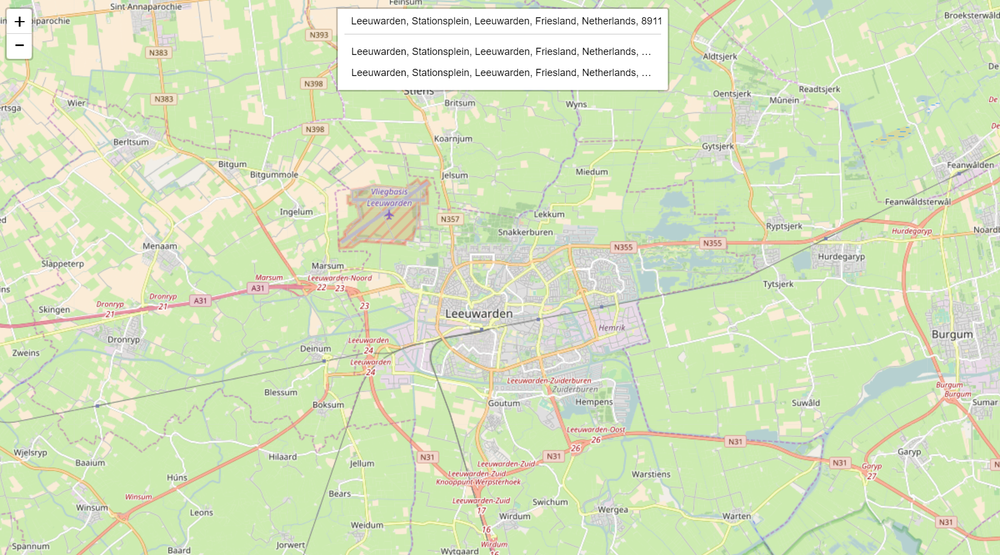
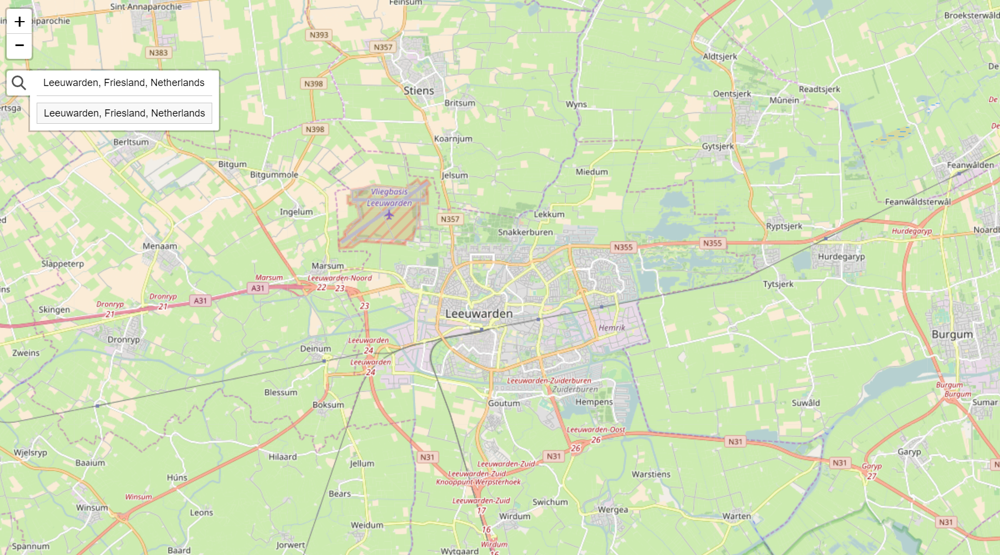

# Leaflet.GeoSearch

[](https://gitter.im/smeijer/leaflet-geosearch?utm_source=badge&utm_medium=badge&utm_campaign=pr-badge&utm_content=badge)

[][9]

[][10]


## Installation

with npm:
```bash
npm install --save leaflet-geosearch
```

or yarn:
```bash
yarn add leaflet-geosearch
```

or bower:
```bash
bower install leaflet-geosearch
```

If you don’t use [npm][11], you may grab the latest [UMD][12] build from 
[unpkg][13] (either a [development][14] or a [production][15] build). The UMD build 
exports a global called `window.GeoSearch` if you add it to your page via a 
`<script>` tag. 

We *don’t* recommend UMD builds for any serious application.

## Browser support / Polyfills
This library is written with the latest technologies in mind. Thereby it is required to include some polyfills when you wish to support older browsers. These polyfills are recommended for IE and Safari support:

- [babel-polyfill][16], for `array.includes` support.
- [whatwg-fetch][17], for `fetch` requests.

# About
This library adds support for geocoding *(address lookup, a.k.a. geoseaching)* 
to your (web) application. It comes with controls to be embedded in your 
[Leaflet][1]
map.

Check out the [demo][2] for various possibilities.

The library uses so-called "providers" to take care of building the correct 
service URL and parsing the retrieved data into a uniform format. Thanks to this 
architecture, it is pretty easy to add your own providers, so you can use 
your own geocoding service(s).

The control comes with a default set of six providers:

  - [Bing](#bing-provider).
  - [Esri](#esri-provider).
  - [Google](#google-provider).
  - [OpenStreetMap](#openstreetmap-provider).
  - [LocationIQ](#locationiq-provider).
  - [OpenCage](#opencage-provider).

Although this project is still named `leaflet-geosearch`, this library is also 
usable without LeafletJS, and does not have any dependencies whatsoever.

# Usage

Let's first start with an little example on how to use this control without 
leaflet. For example as an address lookup on a webshop order form. Perhaps to 
search for the closest alternative package delivery point? Or to link it to your
own custom map component.

```js
// import
import { OpenStreetMapProvider } from 'leaflet-geosearch';

// setup
const provider = new OpenStreetMapProvider();

// search
const results = await provider.search({ query: input.value });
```

Of course, something like this should be bound to something like a form or 
input:

```js
import { OpenStreetMapProvider } from 'leaflet-geosearch';

const form = document.querySelector('form');
const input = form.querySelector('input[type="text"]');

form.addEventListener('submit', async (event) => {
  event.preventDefault();

  const results = await provider.search({ query: input.value });
  console.log(results); // » [{}, {}, {}, ...]
});
```

Instead of es6 `async` / `await` you can also use promises like:

```js
provider
  .search({ query: '...' })
  .then(function(result) { 
    // do something with result;
  });
```

## Results

The `search` event of all providers return an array of `result objects`. The 
base structure is uniform between the providers. It provides a object like:

```js
const result = {
  x: Number,                      // lon,
  y: Number,                      // lat,
  label: String,                  // formatted address
  bounds: [
    [Number, Number],             // s, w - lat, lon
    [Number, Number],             // n, e - lat, lon
  ],
  raw: {},                        // raw provider result
}
```

The contents of the `raw` property differ per provider. This is the unprocessed
result from the 3th party service. This property is included for developer 
convenience. `leaflet-geosearch` does not use it. If you need to know the 
contents of this property, you should check the 3th party developer docs. (or
use your debugger)
  
# Providers
When `OpenStreetMap` does not match your needs; you can also choose to use the 
`Bing`, `Esri`, `Google` `LocationIQ`, or `OpenCage` providers. Those providers do however require API 
keys. See the documentation pages on the relevant organisations on how to obtain 
these keys.
 
In case you decide to write your own provider, please consider submitting a PR
to share your work with us.

Providers are unaware of any options you can give them. They are simple proxies 
to their endpoints. There is only one `special property`, and that is the `params`
option. The difference being; that `params` will be included in the endpoint url. 
Often being used for `API KEYS`, where as the other attributes can be used for
provider configuration.

## Bing Provider
**note**: Bing services require an API key. [Obtain here][7]. 
For more options and configurations, see the [MSDN developer docs][6].

```js
import { BingProvider } from 'leaflet-geosearch';

const provider = new BingProvider({ 
  params: {
    key: '__YOUR_BING_KEY__'
  },
});
```

## Esri Provider
For more options and configurations, see the [ArcGIS developer docs][3].

```js
import { EsriProvider } from 'leaflet-geosearch';

const provider = new EsriProvider();
```

## Google Provider
**note**: Google services require an API key. [Obtain here][8].
For more options and configurations, see the [Google Maps developer docs][4].

```js
import { GoogleProvider } from 'leaflet-geosearch';

const provider = new GoogleProvider({ 
  params: {
    key: '__YOUR_GOOGLE_KEY__',
  },
});
```

## OpenStreetMap Provider
For more options and configurations, see the [OpenStreetMap Nominatim wiki][5].

```js
import { OpenStreetMapProvider } from 'leaflet-geosearch';

const provider = new OpenStreetMapProvider();
```

## LocationIQ Provider
**note**: LocationIQ services require an API key. [Obtain here][18].
For more options and configurations, see the [LocationIQ developer docs][19].

```js
import { LocationIQProvider } from 'leaflet-geosearch';

const provider = new LocationIQProvider({ 
  params: {
    key: '__YOUR_LOCATIONIQ_KEY__',
  },
});
```
## OpenCage Provider
**note**: OpenCage services require an API key. [Obtain here][20].
For more options and configurations, see the [OpenCage developer docs][21].

```js
import { OpenCageProvider } from 'leaflet-geosearch';

const provider = new OpenCageProvider({ 
  params: {
    key: '__YOUR_OPENCAGE_KEY__',
  },
});
```

# Using with LeafletJS

This project comes with a leaflet control to hook the search providers into 
leaflet. The example below uses the `OpenStreetMap Provider`, but you can exchange 
this with on of the other included providers as well as your own custom made 
providers. Remember to setup the provider with a `key` when required (Google and 
Bing for example).



```js
import L from 'leaflet';
import { GeoSearchControl, OpenStreetMapProvider } from 'leaflet-geosearch';

const provider = new OpenStreetMapProvider();

const searchControl = new GeoSearchControl({
  provider: provider,
});

const map = new L.Map('map');
map.addControl(searchControl);
```

## GeoSearchControl
There are some configurable options like setting the position of the search input
and whether or not a marker should be displayed at the position of the search result.


There are two visual styles of this control. One is the more 'leaflet-way' by 
putting the search control under a button (see image above). And one where the 
search control is permanently shown as a search bar (see image under 
[using with LeafletJS](#using-with-leafletjs)).

**Render style**

This render style can be set by the optional `style` option.

```js
new GeoSearchControl({
  provider: myProvider,           // required
  style: 'bar',                   // optional: bar|button  - default button
}).addTo(map);
```

**AutoComplete** 

Auto complete can be configured by the parameters `autoComplete` and 
`autoCompleteDelay`. A little delay is required to not DDOS the server on every
keystroke.

```js
new GeoSearchControl({
  provider: myProvider,           // required
  autoComplete: true,             // optional: true|false  - default true
  autoCompleteDelay: 250,         // optional: number      - default 250
}).addTo(map);
```

**Show result**

There are a number of options to adjust the way results are visualized.
 
```js
new GeoSearchControl({
  provider: myProvider,                               // required
  showMarker: true,                                   // optional: true|false  - default true
  showPopup: false,                                   // optional: true|false  - default false
  marker: {                                           // optional: L.Marker    - default L.Icon.Default
    icon: new L.Icon.Default(),
    draggable: false,
  },
  popupFormat: ({ query, result }) => result.label,   // optional: function    - default returns result label
  maxMarkers: 1,                                      // optional: number      - default 1
  retainZoomLevel: false,                             // optional: true|false  - default false
  animateZoom: true,                                  // optional: true|false  - default true
  autoClose: false,                                   // optional: true|false  - default false
  searchLabel: 'Enter address',                       // optional: string      - default 'Enter address'
  keepResult: false                                   // optional: true|false  - default false
});
```

`showMarker` and `showPopup` determine whether or not to show a marker and/or 
open a popup with the location text.

`marker` can be set to any instance of a (custom) `L.Icon`.

`popupFormat` is callback function for displaying text on popup.

`maxMarker` determines how many last results are kept in memory. Default 1, but
perhaps you want to show the last `x` results when searching for new queries as 
well.

`retainZoomLevel` is a setting that fixes the zoomlevel. Default behaviour is to
zoom and pan to the search result. With `retainZoomLevel` on `true`, the map is
only panned.

`animateZoom` controls whether or not the pan/zoom moment is being animated.

`autoClose` closes the result list if a result is selected by click/enter.

`keepResult` is used to keep the selected result in the search field. This prevents markers to disappear while using the `autoClose` feature. 

**Events**

`geosearch/showlocation` is fired when location is chosen from the result list.

```js
map.on('geosearch/showlocation', yourEventHandler)
```

`geosearch/marker/dragend` is fired when marker has been dragged.

```js
map.on('geosearch/marker/dragend', yourEventHandler)
```

# Development

Checkout the providers to see how easy it is to write your own. For research it
can be interesting to see the difference between Bing and the others; because
Bing does not support `CORS`, and requires `jsonp` to be used instead.

In case you decide to write your own provider, please consider submitting a PR
to share your work with us.

[1]: http://leafletjs.com
[2]: http://smeijer.github.io/leaflet-geosearch
[3]: https://developers.arcgis.com/rest/geocode/api-reference/overview-world-geocoding-service.htm
[4]: https://developers.google.com/maps/documentation/geocoding/start
[5]: http://wiki.openstreetmap.org/wiki/Nominatim
[6]: https://msdn.microsoft.com/en-us/library/ff701714.aspx
[7]: https://msdn.microsoft.com/nl-nl/library/ff428642.aspx
[8]: https://developers.google.com/maps/documentation/javascript/get-api-key
[9]: https://travis-ci.org/smeijer/leaflet-geosearch
[10]: https://nodei.co/npm/leaflet-geosearch
[11]: https://www.npmjs.com
[12]: https://unpkg.com/leaflet-geosearch@latest/dist/
[13]: https://unpkg.com
[14]: https://unpkg.com/leaflet-geosearch@latest/dist/bundle.js
[15]: https://unpkg.com/leaflet-geosearch@latest/dist/bundle.min.js
[16]: https://www.npmjs.com/package/babel-polyfill
[17]: https://www.npmjs.com/package/whatwg-fetch
[18]: https://locationiq.org
[19]: https://locationiq.org/#docs
[20]: https://geocoder.opencagedata.com
[21]: https://geocoder.opencagedata.com/api
